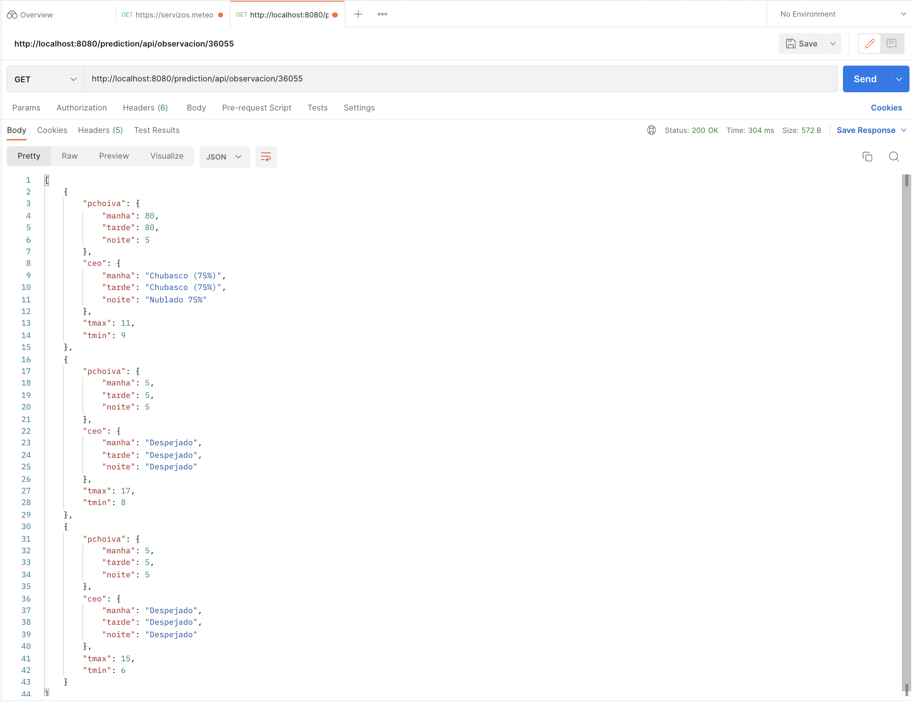

## meteogalicia-api

# Descripción

Se creó, utilizando java, maven y spring-boot, un API REST que consume la aplicación de meteogalicia.

# Funcionalidad
El API consta de una petición GET (http://localhost:8080/prediction/api/observacion/{municipio}) que devuelve una lista con las predicciónes de el dia actual y los dos siguientes para un municipio en concreto. Para cada día se muestra: 
 - pchoiva:  porcentaje de lluvia(mañana, tarde y noche), 
 - ceo (mañana, tarde y noche): situación del cielo.
 - tMax: temperatura máxima
 - tMin: temperatura mínima

# Instalación y Ejecución
Para la ejecución del código, desde la carpeta 'meteogalicia' es necesario realizar los siguientes comando:
- **mvn install** para instalar las dependencias. 
- **mvn spring-boot:run** para lanzar la aplicación.

# Prueba
Para comprobar el correcto funcionamiento, se realizaron peticiones desde Postman. Se adjunta la respuesta con los valores de la búsqueda para el municipio A Coruña(15030). 

